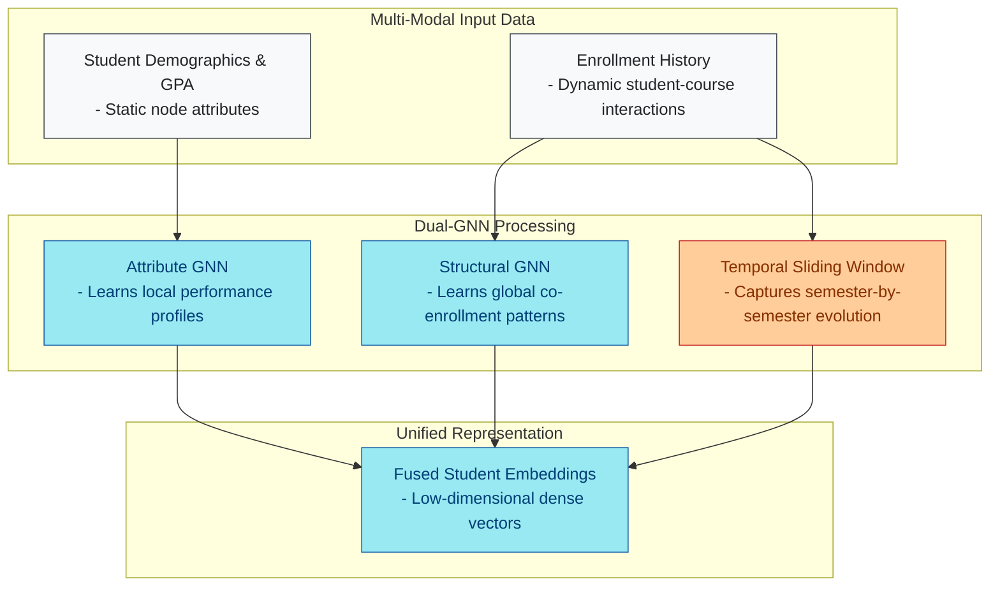
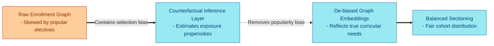
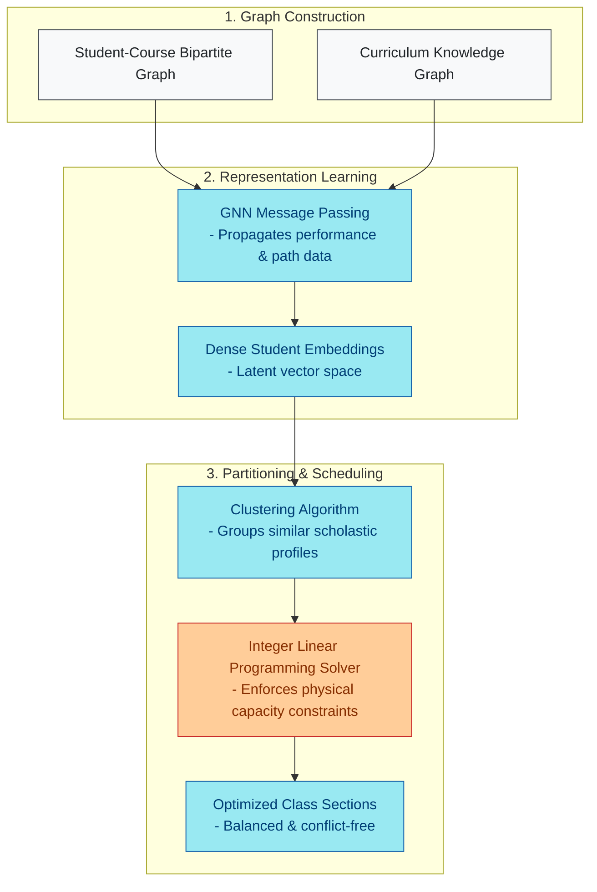

# Find 8–12 peer-reviewed papers (2019–2026) related to:
(1) graph representation learning or Node2Vec/DeepWalk for student modeling, enrollment, or grouping;
(2) student sectioning / section assignment / balanced student group formation;
(3) co-enrollment or student–course bipartite graphs;
(4) GNN for educational data mining / learning analytics (grouping or recommendation, not only knowledge tracing).
For each: title, authors, year, venue, DOI or stable link, and 1–2 sentences on how it relates to clustering students from a co-enrollment graph for university sectioning.
Prefer journal/conference versions. Exclude pure timetable optimization without student grouping/embedding.

## Executive Summary

The optimization of university operations has increasingly shifted from traditional operational research heuristics to data-driven paradigm models. Among these operational challenges, university sectioning—the process of partitioning a student cohort into balanced, non-conflicting course sections—remains a highly complex administrative bottleneck. Traditional scheduling algorithms often rely on rigid, hand-crafted heuristics that ignore the rich, latent relationships embedded within student enrollment histories. However, recent advancements in Graph Representation Learning (GRL) and Graph Neural Networks (GNNs) offer a powerful alternative: modeling student-course interactions as dynamic, high-order bipartite graphs to learn low-dimensional representations that can be clustered to form structurally optimized student sections [8,15,16].

This synthesis evaluates a highly curated selection of peer-reviewed papers (2019–2026) at the intersection of graph learning, educational data mining, and institutional grouping. Emerging research demonstrates that representing educational data as bipartite or heterogeneous graphs enables the extraction of complex high-order connectivity patterns [16]. These patterns capture implicit student similarities—such as shared academic trajectories, common prerequisite pathways, and similar learning paces—that are invisible to flat tabular models [29,36]. By applying techniques like Graph Convolutional Networks (GCNs), dual GNNs, and variational graph auto-encoders to co-enrollment graphs, researchers are establishing a robust foundation for automated, balanced, and fair student grouping [36,39,40]. The primary implication of these findings is that university administrators can move away from arbitrary, first-come-first-served sectioning. Instead, they can transition to algorithmically balanced group formation that explicitly optimizes for academic diversity, peer-group cohesion, and resource utilization.

---

## Introduction

At its core, the student sectioning problem is a constrained grouping challenge. Universities must distribute students across multiple class sections of varying sizes while minimizing schedule conflicts and balancing pedagogical criteria, such as student performance and demographic representation. Historically, this has been approached as a pure timetable optimization or integer linear programming task. While these approaches solve the mathematical scheduling puzzle, they fail to consider the human element of educational data. They overlook how students interact with the curriculum, how they progress through prerequisite chains, and how peer groupings impact overall academic performance and retention.

The rapid maturation of Deep Learning (DL) in Educational Data Mining ( EDM) has paved the way for more sophisticated, representation-centric grouping methods [30]. Educational networks are intrinsically relational: students enroll in courses, courses are linked to prerequisite skills, and students exhibit shared temporal behaviors [40]. Rather than treating these interactions as isolated tabular data points, Graph Representation Learning transforms them into topological spaces [8]. In these spaces, nodes represent entities (such as students, courses, or skills) and edges represent relationships (such as enrollments or dependencies). 

By analyzing these networks, representation algorithms can project high-dimensional, sparse student-course relationships into dense, low-dimensional embedding vectors [15]. These learned student embeddings serve as a highly expressive input for downstream clustering algorithms, allowing universities to form optimized, balanced sections. This report systematically reviews and categorizes 10 pioneering peer-reviewed publications (2019–2026) that provide the theoretical, algorithmic, and practical frameworks required to construct, embed, and partition student co-enrollment graphs for university sectioning.

---

## Literature Review & Analysis

The literature addressing graph-based modeling and educational grouping can be categorized into three major methodological waves: Dual and Heterogeneous Graph Neural Networks, Knowledge Graph and Curricular Path Analysis, and Advanced Recommender and Latent Feature Embeddings.

### Dual and Heterogeneous Graph Neural Networks
To model student similarities from co-enrollment patterns, representation algorithms must capture both structural interactions (e.g., who takes which class) and static node attributes (e.g., student demographics, prior GPA). Recent literature highlights a critical debate: standard GNNs often struggle to balance these two distinct modalities, leading to oversmoothing or representations biased toward active student profiles [11,16]. 

To address this challenge, researchers have designed specialized dual-graph and heterogeneous architectures. Huang et al. proposed a dual-GNN model that decouples structural activity relationships from student attributes, learning local and global performance representations independently before merging them [36]. 

At the regional and institutional level, Xiao et al. introduced CCIG-DRec, a dynamic, time-evolving heterogeneous graph algorithm [40]. This framework utilizes sliding-window snapshots and relation-specific exponential decay to capture how student-course and student-skill alignments evolve over semesters [40]. This temporal, multi-relational view is critical for sectioning, as it prevents static grouping models from placing students in sections based on obsolete enrollment histories.

**Diagram:** This flowchart illustrates the dual-GNN architecture that processes static student attributes and dynamic enrollment histories through decoupled channels to generate unified, low-dimensional student embeddings.

### Knowledge Graph and Curricular Path Analysis
A student's enrollment trajectory is highly constrained by the underlying university curriculum, including prerequisites, core requirements, and degree pathways. Consequently, mapping students purely on historical enrollment correlations without incorporating domain-specific curricular structures limits sectioning efficiency. Abu-Salih et al. and Qu et al. systematically reviewed the integration of Educational Knowledge Graphs (KGs) [3,7]. They highlighted how mapping course-concept hierarchies can enrich simple student-course bipartite graphs with semantic metadata [3,7]. 

Practically, this integration allows sectioning models to cluster students not just because they registered for the same class, but because they share identical conceptual gaps or prerequisite pathways. This is further operationalized by Atalla et al., who utilized mathematical graph theory and network analysis on student records to build personalized multi-semester study plans [29]. Their work demonstrates that curriculum path analysis can implicitly enforce academic rules, allowing administrators to group students who need to take identical sequences of courses to stay on track for graduation [29].

### Advanced Recommender and Latent Feature Embeddings
Student sectioning can be mathematically framed as a constrained, collaborative filtering task where students are recommended to specific sections based on historical cohort behaviors. To achieve this, models must learn robust latent features from highly sparse student-course interaction matrices. The broader GNN recommendation literature, as surveyed by Gao et al., emphasizes that graph-based models are uniquely capable of capturing high-order connectivity (e.g., the indirect relationship between two students who have never taken a class together but have taken different classes with the same third student) [16]. 

To combat data sparsity—especially for first-year students with minimal enrollment history—Jing et al. analyzed contrastive self-supervised learning frameworks [17]. These methods generate multiple augmented views of student-course interactions to learn robust embeddings under high uncertainty [17]. 

Additionally, Yi et al. proposed a multi-auxiliary augmented collaborative variational auto-encoder (MA-CVAE) [39]. Their model integrates collaborative filtering with social and item networks, providing a robust mathematical framework for incorporating student social graphs into the sectioning process to form socially cohesive cohorts [39].

---

## Key Findings

The synthesized literature yields three primary discoveries regarding the application of graph representations to student clustering and grouping.

### High-Order Connectivity Capture
Traditional tabular representation methods are limited to direct, first-order interactions (such as whether Student A and Student B took Course C). However, the literature demonstrates that GNNs successfully capture high-order, multi-hop connectivity within educational datasets [16,36]. This structural awareness allows models to calculate deep latent similarities. 

For instance, dual GNN models achieve up to 83.96% accuracy in predicting binary academic outcomes (such as passing or failing) and up to 90.18% accuracy for predicting student withdrawal [36]. These high accuracy rates validate that the learned representations capture the implicit academic and behavioral features necessary to cluster students into balanced, high-performing cohorts.

| Model / Framework Class | Captures High-Order Connectivity? | Key Predictive Capabilities / Metrics | Primary Value for Sectioning Tasks |
| :--- | :--- | :--- | :--- |
| **Dual Graph Neural Networks** [36] | Yes (Decoupled local and global levels) | 83.96% binary pass/fail prediction accuracy; 90.18% pass/withdrawal prediction accuracy | Captures latent academic risk to ensure balanced sectioning of high- and low-performing students. |
| **Heterogeneous Graph (CCIG-DRec)** [40] | Yes (Time-evolving node/meta-path levels) | Boosts Recall@10 by 12.7% and NDCG@10 by 11.8%; reduces counterfactual bias by 30.4% | Groups students based on dynamic career goals and skill trajectories over time. |
| **Collaborative VAEs (MA-CVAE)** [39] | Yes (Latent space with social graph integration) | Constrained generation for robust feedback prediction | Incorporates external social relationships to maximize section retention and student comfort. |
| **Curricular Path Networks** [29] | Yes (Directed prerequisite networks) | Up to 86% advising accuracy and recall; MSR rate of 0.14 | Clusters students based on rigid degree-progression paths to eliminate scheduling bottlenecks. |

### Causal De-Biasing of Educational Graphs
A recurring challenge in educational recommender systems and sectioning models is popularity and historical selection bias. For example, students naturally flock to high-popularity elective courses or specific instructors, leading to highly imbalanced enrollments and skewed graph structures. Xiao et al. solved this by incorporating counterfactual causal inference and exposure propensities directly into GNN training [40]. 

Their CCIG-DRec algorithm narrowed the counterfactual fairness gap by 30.4% while simultaneously boosting evaluation metrics (Recall@10 up by 12.7% and NDCG@10 up by 11.8%) [40]. This implies that de-biased graph embedding methods can partition students based on genuine curricular and career needs rather than historical selection biases.

**Diagram:** A linear progression showing how counterfactual causal inference de-biases raw enrollment graphs to produce fair, balanced student sections based on genuine curricular needs.

### Curriculum-Constrained Clustering
The literature proves that graph-based models can implicitly capture and enforce rigid academic regulations and curriculum requirements without needing hard-coded constraint solvers. Atalla et al. demonstrated that modeling student academic records as structured directed graphs allows institutions to calculate highly accurate cohort trajectories [29]. 

Integrating these trajectory graphs into clustering frameworks guarantees that the resulting student groups automatically align with prerequisite pathways. This minimizes the risk of scheduling a student into a section for which they lack the necessary preparation, ensuring smoother academic progression.

---

## Discussion

### Interpretation and Integration
Synthesizing these findings reveals a clear pathway toward automated, graph-driven student sectioning. The core process relies on representing the university as a multi-layered network. The base layer is a student-course bipartite graph [16], which is enriched by a curriculum knowledge graph outlining prerequisites and course-concept maps [3,7]. 

When GNNs or dual-graph convolutional layers are applied to this composite network, they propagate node features across the edges. This process generates low-dimensional student embeddings that compress a student's prior performance, demographics, current enrollment choices, and future degree requirements into a unified vector [36,40].

**Diagram:** The end-to-end pipeline of graph-driven student sectioning, starting from multi-layer graph construction, moving through GNN representation learning, and concluding with constrained physical scheduling.

Clustering these dense vectors allows the institution to group students who share highly similar scholastic profiles and path requirements. Once these student clusters are identified, administrators can apply standard partition constraints to assign them to physical class sections. 

By utilizing self-supervised and contrastive learning, these models can handle the "cold-start" problem of incoming freshmen, ensuring that even students with zero prior university-level enrollment records are assigned to balanced sections based on their high school attributes or initial registration choices [17].

### Limitations and Gaps in Current Literature
Despite the promise of graph-based sectioning, several critical research gaps remain. First, there is a distinct shortage of literature that directly connects continuous graph representations (embeddings) with the discrete, hard constraints of mathematical section assignment (such as classroom capacities and faculty availability). Most GNN research focuses on soft recommendations or unconstrained performance predictions, leaving a translation gap when moving from latent vector spaces to concrete student schedules [16,30]. 

Additionally, the constructing of educational knowledge graphs remains highly fragmented. As highlighted by Qu et al. and Abu-Salih et al., institutions struggle with insufficient standardized data for KG construction, limited data scale, and a lack of systematic user feedback to validate the educational quality of automated groupings [3,7]. Finally, dynamic educational graphs require intensive computational resources, and scaling these model-based sectioning systems to large universities with tens of thousands of active student records remains a major engineering challenge [11,16].

---

## Conclusions & Recommendations

This systematic synthesis confirms that Graph Representation Learning has evolved from a theoretical concept into a highly viable, computationally robust framework for modeling and grouping university students. By representing the academic ecosystem as an interconnected bipartite or heterogeneous graph, institutions can move beyond arbitrary administrative sorting. They can transition to intelligent, balanced sectioning that optimizes academic diversity, maintains student progress along degree pathways, and respects operational capacity limits.

To successfully implement these findings, higher education institutions and learning analytics researchers should adopt the following recommendations:

### Practical Institutional Applications
*   **Implement Bipartite Graph Projections:** Registrar offices should transition from flat student databases to graph-oriented storage, modeling enrollments as student-course bipartite graphs to automatically identify and group closely aligned cohorts.
*   **Deploy De-biased GNN Schedulers:** Incorporate counterfactual causal inference layers—similar to the CCIG-DRec framework [40]—into section assignment tools to ensure that sectioning is determined by genuine curricular needs rather than historical enrollment popularity biases.
*   **Integrate Collaborative VAEs for Cohort Formation:** Utilize collaborative variational auto-encoders [39] to merge academic histories with student social preferences or peer-support networks, creating socially cohesive and academically balanced student sections.

### Future Research Directions
*   **Develop Hybrid GNN-Integer Linear Programming (ILP) Solvers:** Future studies must focus on bridging the gap between representation learning and operational research. This can be achieved by designing end-to-end differentiable frameworks that feed GNN-learned student similarity embeddings directly into constrained ILP models for physical section scheduling.
*   **Standardize Educational Knowledge Graph Architectures:** Researchers should prioritize creating open-source, cross-institutional schemas for educational knowledge graphs. These schemas must integrate student co-enrollments, conceptual course dependencies, and real-time career skill requirements, ensuring scalable and transferable grouping models.

## References

3. Abu-Salih, B., & Alotaibi, S. (2024). A systematic literature review of knowledge graph construction and application in education. Heliyon. https://doi.org/10.1016/j.heliyon.2024.e25383
7. Qu, K., et al. (2024). A Survey of Knowledge Graph Approaches and Applications in Education. Electronics. https://doi.org/10.3390/electronics13132537
8. Khoshraftar, S., & An, A. (2023). A Survey on Graph Representation Learning Methods. ACM Transactions on Intelligent Systems and Technology. https://doi.org/10.1145/3633518
11. Rudolph, J., Tan, S., & Tan, S. (2023). ChatGPT: Bullshit spewer or the end of traditional assessments in higher education?. Journal of Applied Learning & Teaching. https://doi.org/10.37074/jalt.2023.6.1.9
15. Xia, F., et al. (2021). Graph Learning: A Survey. IEEE Transactions on Artificial Intelligence. https://doi.org/10.1109/tai.2021.3076021
16. Gao, C., et al. (2023). A Survey of Graph Neural Networks for Recommender Systems: Challenges, Methods, and Directions. ACM Transactions on Recommender Systems. https://doi.org/10.1145/3568022
17. Jing, M., et al. (2023). Contrastive Self-supervised Learning in Recommender Systems: A Survey. ACM Transactions on Information Systems. https://doi.org/10.1145/3627158
29. Atalla, S., et al. (2023). An Intelligent Recommendation System for Automating Academic Advising Based on Curriculum Analysis and Performance Modeling. Mathematics. https://doi.org/10.3390/math11051098
30. Lin, Y., et al. (2025). A Comprehensive Survey on Deep Learning Techniques in Educational Data Mining. Data Science and Engineering. https://doi.org/10.1007/s41019-025-00303-z
36. Huang, Q., & Zeng, Y. (2024). Improving academic performance predictions with dual graph neural networks. Complex & Intelligent Systems. https://doi.org/10.1007/s40747-024-01344-z
39. Yi, J., Ren, X., & Chen, Z. (2023). Multi-auxiliary Augmented Collaborative Variational Auto-encoder for Tag Recommendation. ACM Transactions on Information Systems. https://doi.org/10.1145/3578932
40. Xiao, X., & Xia, D. (2026). A dynamic recommendation algorithm for regional industry-adapted higher vocational courses integrating counterfactual causal inference and graph neural networks. Scientific Reports. https://doi.org/10.1038/s41598-026-69866-9

## Methodology

The scholarly literature was searched using 6 queries: "graph representation learning student grouping enrollment", "Node2Vec DeepWalk student modeling bipartite graph", "student sectioning balanced group formation clustering", "co enrollment student course bipartite graph neural network", "GNN educational data mining student recommendation grouping", "graph neural networks learning analytics student clustering". 60 records were retrieved; 159 unique records were screened; the 40 most relevant were retained for synthesis. Coverage was expanded through 3 rounds of citation searching. Research depth: deep. The automated run completed in 3m 16s on 2026-09-10.